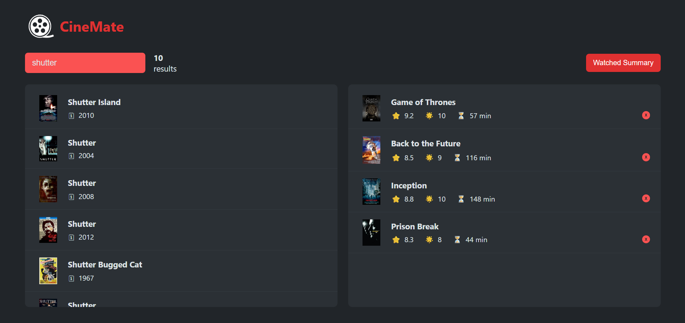
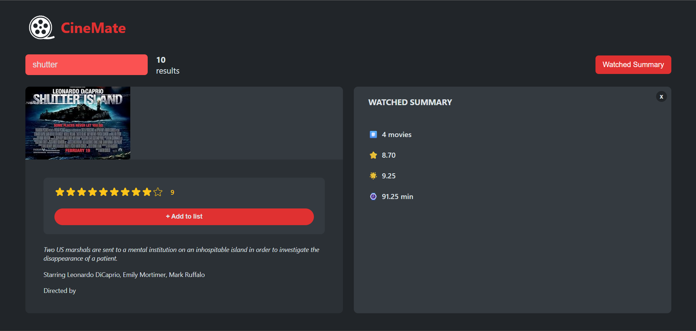

# 🎬 CineMate

CineMate is a simple and modern movie web app where users can:

- 🔍 **Search** for movies
- ⭐ **Rate** them
- 📃 **Create a list** of favorites

Whether you're discovering new films or organizing your favorites, CineMate makes movie browsing fun and easy.

---

## 🚀 Features

- Real-time movie search using API
- Rate movies you've watched
- Maintain a personal favorites list
- Responsive and clean UI

---

## 🖼 Preview

---

## 📦 Tech Stack

- **Frontend:** React
- **Styling:**  Custom CSS
- **Data:** Fetches from [OMDb API](https://www.omdbapi.com/) 

---

## 📂 Getting Started

1. Clone the repository: git clone https://github.com/AbdullahMedhat141/CineMate.git, then go to the project folder: cd cinemate
2. Install Dependencies: npm install
3. Start the App: npm run dev
